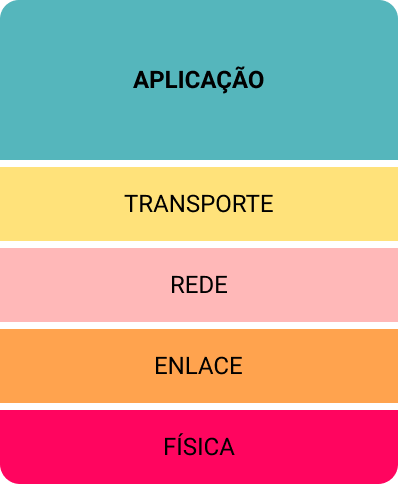
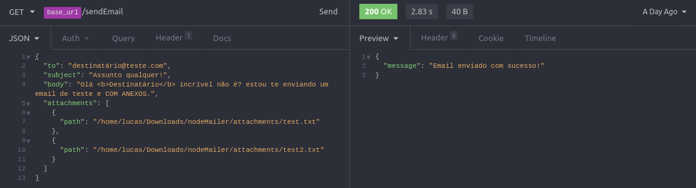

# Visão geral da biblioteca nodemailer

É comum que precisemos implementar um endpoint de enviar emails em nosso sistema, seja para enviar um email de boas vindas após o cadastro de um novo usuário, enviar a fatura todo dia 30 aos clientes ou até mesmo para integrar com o sistema de recuperação de senhas.


# Nodemailer

Atualmente a biblioteca mais popular para lidar com o envio de e-mails em Node.Js é a **Nodemailer**, segura, leve e simples de utilizar.


## Interface SMTP

O **SMTP** é um protocolo de correio eletrônico e ele é utilizado na camada de aplicação, além de usar o protocolo de transporte TCP para a transmissão de mensagens.



Basicamente, um cliente envia um email utilizando **SMTP** para seu provedor, a partir dai esse provedor encaminha o email para o provedor do destinatário e só então o cliente final recupera o email, mas dessa vez através de outros protocolos como **POP3**, **IMAP** e **HTTP** por exemplo.


## Prática

Tendo dito isso, vamos a prática: A primeira coisa que você precisa saber é o que este projeto faz, básicamente enviamos um json no corpo da requisição contendo *destinatário*, *assunto*, *body* e **opcionalmente** *anexos*.

```json
{
	"to": "destinatário@teste.com",
	"subject": "Assunto qualquer!",
	"body": "Olá <b>Destinatário</b> incrível não é? estou te enviando um email de teste e COM ANEXOS.",
	"attachments": [
		{
			"path": "/home/lucas/Downloads/nodeMailer/attachments/test.txt"
		},
		{
			"path": "/home/lucas/Downloads/nodeMailer/attachments/test2.txt"
		}
	]
}
```

Se você desejar, pode utilizar o **Insominia** para realizar as requisições, mas também existem outras alternativas como **Postman** por exemplo.



### Endpoint

O endpoint se encontra dentro da pasta src/modules/sendEmail, onde temos um arquivo de configuração que simplesmente importa as variáveis de ambiente necessárias.

```javascript
const config = require('../../config');

module.exports = {
    host: config.get('transporter.provider.host'),
    port: config.get('transporter.provider.port'),
    secure: config.get('transporter.provider.secure'),
    auth: {
      user: config.get('transporter.auth.user'),
      pass: config.get('transporter.auth.password')
    },  
};
```
Quando trabalhamos com informações senssíveis como email e senha do email da empresa, não é legal que deixemos essas informações jogadas no meio do código, para isso utilizamos o [**Convict**](https://www.npmjs.com/package/convict) e o [**dotEnv**](https://www.npmjs.com/package/dotenv), você pode conferir as variáveis de ambiente em src/config.js:

```javascript
const config = convict({
  env: {
    doc: 'The application environment.',
    format: ['production', 'development', 'test'],
    default: 'development',
    env: 'NODE_ENV',
  },
  port: {
    doc: 'The port to bind the app.',
    format: 'port',
    default: 3000,
    env: 'NODEMAILER_PORT',
  },
  transporter: {
    provider: {
      host: {
        doc: 'smtp',
        format: String,
        default: '',
        env: 'NODEMAILER_TRANSPORTER_SMTP',
      },
      port: {
        doc: 'port',
        format: String,
        default: '',
        env: 'NODEMAILER_TRANSPORTER_PORT',
      },
      secure: {
        doc: 'SSL/TLS',
        format: Boolean,
        default: false,
        env: 'NODEMAILER_TRANSPORTER_SECURE',
      },
    },
    auth: {
      user: {
        doc: 'user email',
        format: String,
        default: '',
        env: 'NODEMAILER_TRANSPORTER_EMAIL',
      },
      password: {
        doc: 'user password',
        format: String,
        default: '',
        env: 'NODEMAILER_TRANSPORTER_PASSWORD',
      },
    },
    name: {
      doc: 'company name',
      format: String,
      default: '',
      env: 'NODEMAILER_TRANSPORTER_COMPANY_NAME',
    },
  },
});
```

Lembre-se de que quando for rodar o projeto em sua máquina, você precisa setar as variáveis no arquivo .env, para isso temos um .envsample:

```
NODE_ENV=development
NODEMAILER_PORT=3000
NODEMAILER_TRANSPORTER_SMTP=
NODEMAILER_TRANSPORTER_PORT=
NODEMAILER_TRANSPORTER_SECURE=
NODEMAILER_TRANSPORTER_EMAIL=
NODEMAILER_TRANSPORTER_PASSWORD=
NODEMAILER_TRANSPORTER_COMPANY_NAME=
```

Agora finalmente vamos para o arquivo de rotas:

```javascript
const express = require('express');
const controller = require('./controller');
const { validationMiddleware } = require('../validation');
const schemas = require('./validations');

const router = express.Router();

router.get('/', validationMiddleware(schemas.emailBody, 'body'), controller.sendEmail);

module.exports = router;

```

Note que utilizamos um middleware de validação:

```javascript
router.get('/', validationMiddleware(schemas.emailBody, 'body'), controller.sendEmail);
```

É sempre importante que validemos as entradas por uma questão de segurança, para isso utilizamos a biblioteca 
[**@hapi/joi**](https://www.npmjs.com/package/@hapi/joi):

```javascript
const Joi = require('@hapi/joi');
const { errorMessages } = require('../validation/i18n');

module.exports = {
  emailBody: Joi.object().keys({
    to: Joi.string()
    .required()
    .messages({
        'any.required': errorMessages.MESSAGES.ANY_REQURIED,
      }),
    subject: Joi.string()
      .max(255)
      .required()
      .messages({
        'string.max': errorMessages.MESSAGES.STRING_MAX,
        'any.required': errorMessages.MESSAGES.ANY_REQURIED,
      }),
    body: Joi.string()
      .required()
      .messages({
        'any.required': errorMessages.MESSAGES.ANY_REQURIED,
      }),
    attachments: Joi.array()
    .items(
      Joi.object({
        path: Joi.string()
      })
    )
  }),
};

```

Você pode alterar as validações se quiser, neste caso me preocupei apenas com o mínimo apenas para fins de demonstração.

Após isso, seguimos para o controller, o código aqui é bem auto-explicativo, simplesmente chamamos a função sendEmail contida no service.js passando como parametro aquilo que recebemos na requisição:

```javascript
const service = require('./service');

module.exports = {
  sendEmail: async (req, res, next) => {
    try {
      const response = await service.sendEmail(req.body);
      if (response === true) {
        res.json({ message: 'Email enviado com sucesso!' });
      } else {
        res.status(400).json({ message: 'Houve um erro ao enviar o email!' });
      }
    } catch (err) {
      next(err);
    }
  }
};

```

O **service.js** é certamente a parte mais legal de todas, por tanto vamos com calma, parte por parte:

Após receber o obj, fazemos uma desestruturação:
```javascript
const { to, subject, body, attachments } = obj;
```

Depois criamos um objeto mailOptions:
```javascript
const mailOptions = {
      from: `${companyName} <${configTransporter.auth.email}>`,
      to,
      subject,
      html: body,
    };
```
Lembrando que a variável companyName está vindo de uma variável de ambiente, mas você pode deixa-la fixa **hardCode** se quiser ou simplesmente nem utilize, no caso da não utilização da mesma, o email será enviado com o nome padrão definido na conta de email.

Em seguida criamos um outro objeto mailOptionsWithAttachments:
```javascript
const mailOptionsWithAttachment = {
      ...mailOptions,
      attachments,
    };
```
A ideia aqui é fazer algo como *extends*, ou seja, fazer esse objeto herdar tudo que o outro tem, como uma sub-classe herda da super-classe em Java ou outras linguagens, mas no caso do Javascript da para fazer isso utilizando o **Spread Operator** e objetos.


Depois disso fazemos uma verificação de modo que se conter anexos, então envia um objeto ou outro:
```javascript
try {
      let parsedMailOptions = mailOptions;
      if (attachments !== null) {
        parsedMailOptions = mailOptionsWithAttachment;
      }
      await transporter.sendMail(parsedMailOptions);
      return true;
    } catch (err) {
      return err;
    }
```

Se neste ponto você ficou um pouco confuso, talvez suas dúvidas sejam sanadas observando o modo como um anexo é enviado 
[clicando aqui](https://community.nodemailer.com/using-attachments/)
.

Pronto! é só isso.